# 📇 Jekyll Theme Manpage

> This theme is currently being beta tested and any feedback is greatly appreciated!

[](https://app.netlify.com/sites/jekyll-theme-manpage/deploys)

A minimalist Jekyll theme inspired by Linux man pages. Perfect for personal websites, portfolios, and blogs with a technical focus.

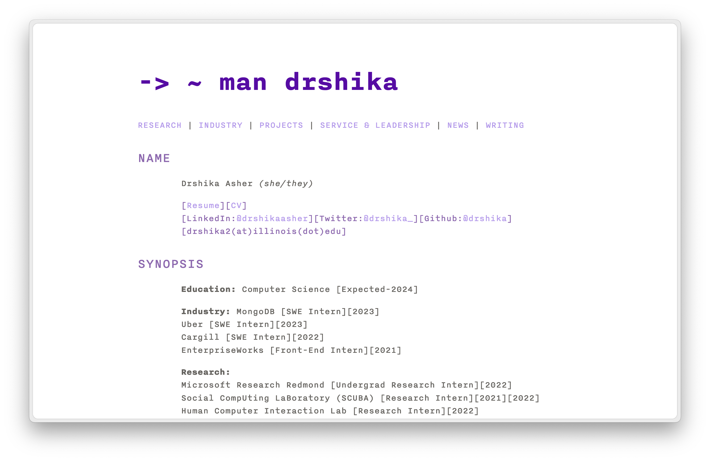

## Features

- 🖥️ Linux man page inspired design
- 📱 Fully responsive layout
- 🌙 Automatic dark mode support
- ✍️ Blog/writing section with:
  - Full-text search
  - Tag filtering
  - Table of contents
  - Reading Time
- 📐 LaTeX support for mathematical expressions
- 🎨 Multiple color themes with light/dark variants
- 🚀 Fast and lightweight
- 📱 Mobile-first approach
- 🔍 SEO optimized
- 📊 Sitemap generation
- 💬 Giscus comments integration
- 📡 RSS feed support

## Installation

1. Follow the step to [create repository from template](https://docs.github.com/en/repositories/creating-and-managing-repositories/creating-a-repository-from-a-template#creating-a-repository-from-a-template)
2. When prompted to select a branch, select the `template` branch. 

## Usage

### Basic Setup

1. Create your site structure following Jekyll conventions
2. Configure `_config.yml` with your settings
3. Add content to `index.md` using the provided template

### Writing Posts

Create posts in `_posts` directory following this format:

```markdown
---
layout: post
title: Your Post Title
description: Brief description
tags: [tag1, tag2]
toc: true # Optional table of contents
---
Your content here...
```

Make sure to name the file with the `YYYY-MM-DD-Title.md`. 


### Customization

#### Color Themes

The theme comes with several preset color schemes. Currently changing the theme is only supported for local development. 

### Light Themes
| Theme | Preview |
|-------|---------|
| Purple | 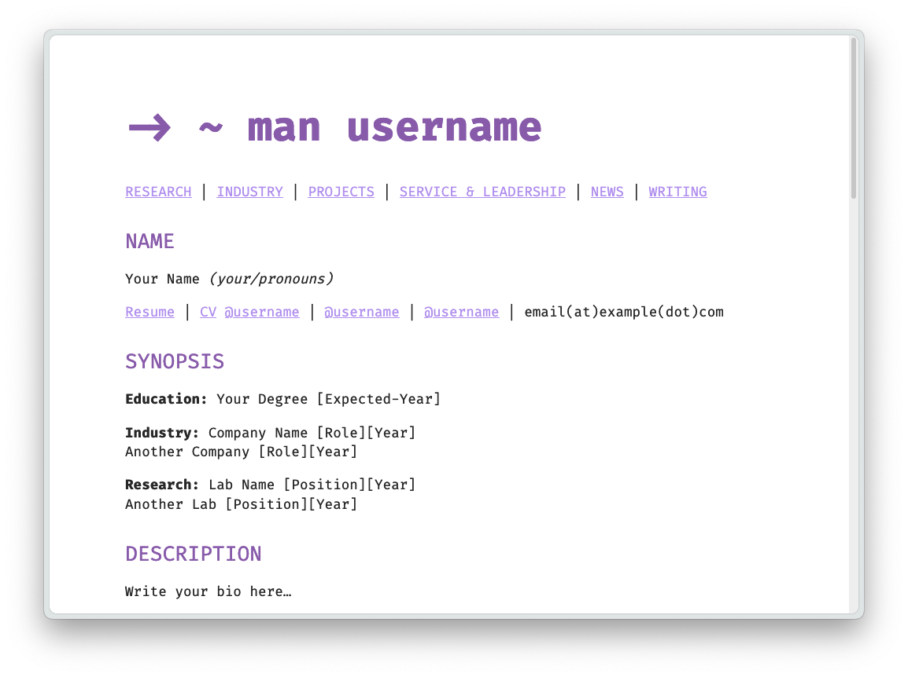 |
| Tomorrow | 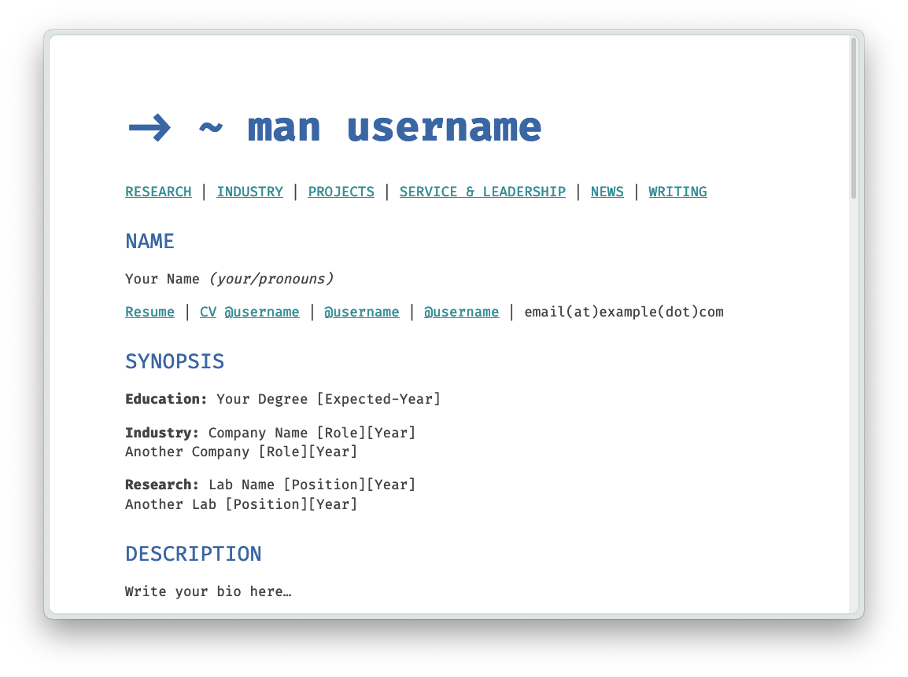 |
| GitHub | 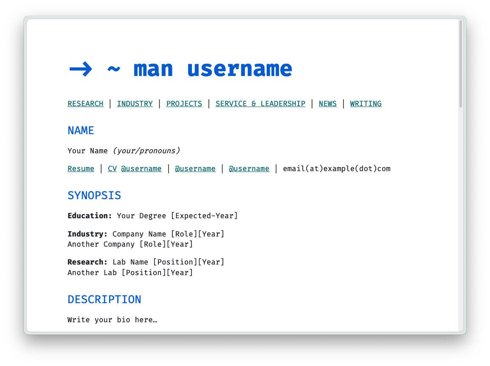 |
| Dracula | 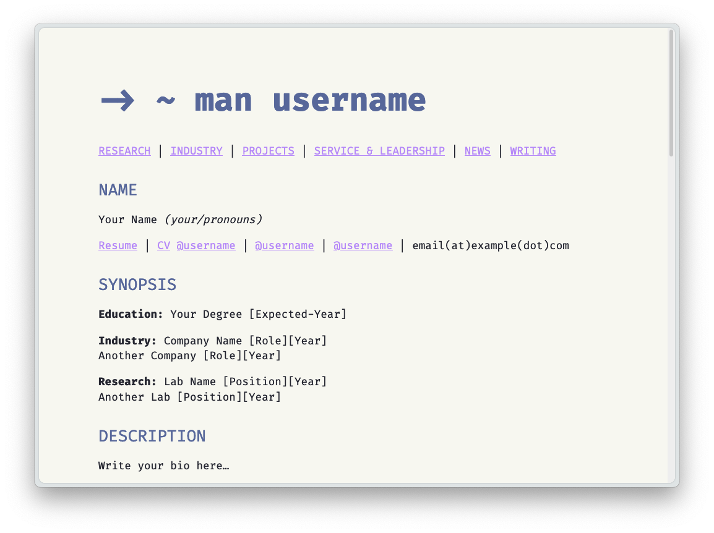 |
| Nord | 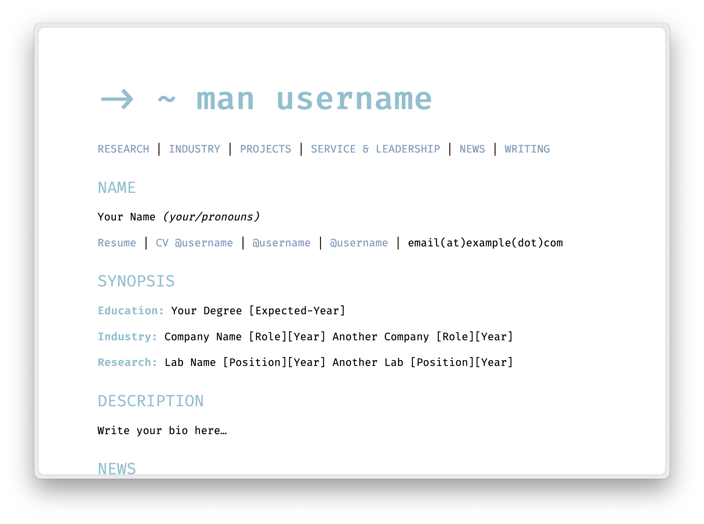 |
| Monokai | 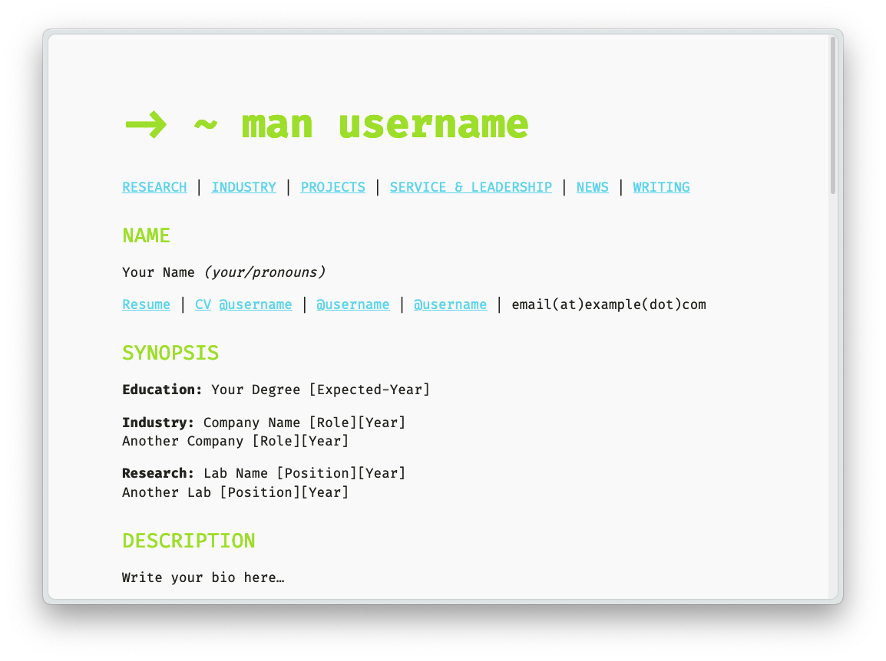 |

### Dark Themes
| Theme | Preview |
|-------|---------|
| Purple | 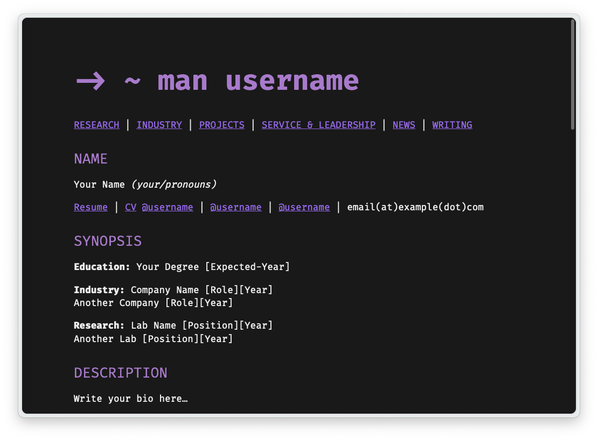 |
| Tomorrow | 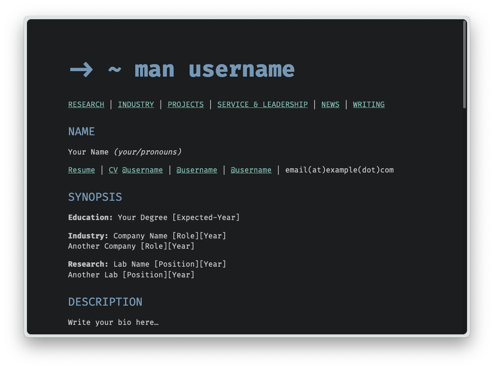 |
| GitHub | 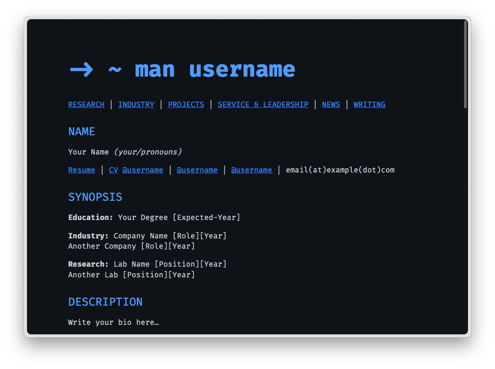 |
| Dracula | 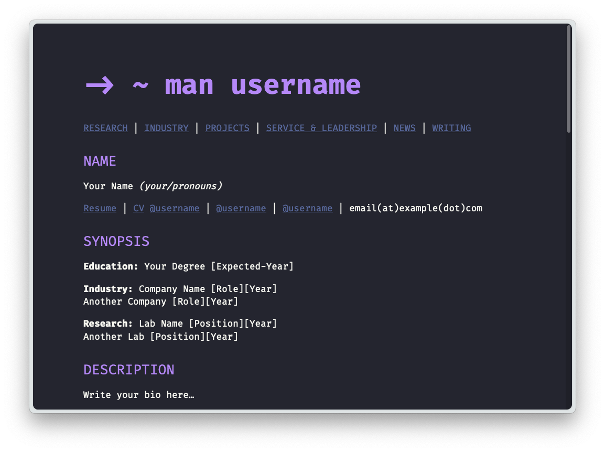 |
| Nord | 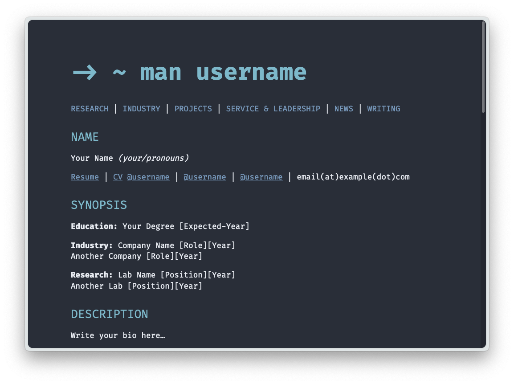 |
| Monokai |  |


To use any of these themes, update your `_sass/variables.scss`:

```scss
// Theme selection
$default-theme: 'nord';
$default-mode: 'light';
```

#### Typography

This theme uses Nitti as its default font. You can purchase Nitti from [Adobe Fonts](https://fonts.adobe.com/fonts/nitti). If you don't have Nitti, the theme will fallback to Fira Code.

## Development

(For local use only!) To set up your environment to develop this theme:

1. Clone this repo
2. Run `bundle install`
3. Run `bundle exec jekyll serve`
4. Visit `http://localhost:4000`

## Optional Features

Enable optional features in your `_config.yml`:

```yaml
features:
  comments: true  # Set to true to enable Giscus comments
  rss_feed: true  # Set to true to enable RSS feed
  search: true  # Set to true to enable search
  google_analytics: false  # Set to true to enable Google Analytics
  tags: true  # Set to true to enable tags
  read_time: true  # Set to true to enable read time
  back_to_top: false  # Set to true to enable back to top button
```

### Comments

To enable comments:

1. Set `features.comments: true` in your `_config.yml`
2. Get your Giscus script from [giscus.app](https://giscus.app)
3. Paste the generated script into `_includes/comments.html`

Disable comments for specific posts by adding `comments: false` to the post's front matter.

### RSS Feed

To enable RSS feed:

1. Set `features.rss_feed: true` in your `_config.yml`

Your feed will be available at `/feed.xml`.

### RSS Feed

To enable RSS feed:

1. Set `features.rss_feed: true` in your `_config.yml`

Your feed will be available at `/feed.xml`. See [Jekyll Feed documentation](https://github.com/jekyll/jekyll-feed) for additional configuration options.

## Contributing

Bug reports and pull requests are welcome on GitHub. This project is intended to be a safe, welcoming space for collaboration, and contributors are expected to adhere to the [Contributor Covenant](https://www.contributor-covenant.org/) code of conduct.

## License

The theme is available as open source under the terms of the [MIT License](https://opensource.org/licenses/MIT).

## Credits

Created with ❤️ by Drshika Asher
