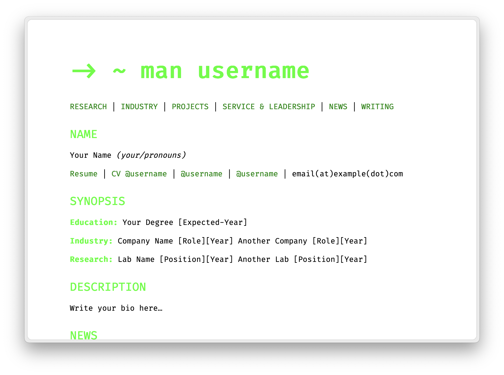
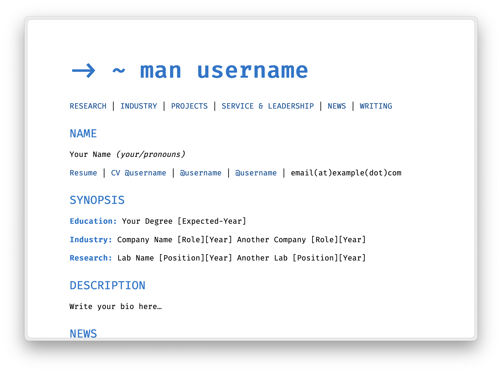
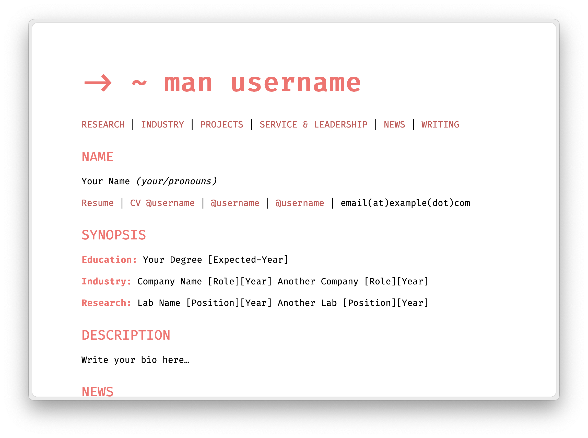

# Jekyll Theme Manpage

[](https://app.netlify.com/sites/jekyll-theme-manpage/deploys)

A minimalist Jekyll theme inspired by Linux man pages. Perfect for personal websites, portfolios, and blogs with a technical focus.


## Features

- 🖥️ Linux man page inspired design
- 📱 Fully responsive layout
- 🌙 Automatic dark mode support
- ✍️ Blog/writing section with:
  - Full-text search
  - Tag filtering
  - Table of contents
- 📐 LaTeX support for mathematical expressions
- 🎨 Multiple color themes
- 🚀 Fast and lightweight
- 📱 Mobile-first approach

## Installation

Add this line to your Jekyll site's `Gemfile`:

```ruby
gem "jekyll-theme-manpage"
```

And add this line to your Jekyll site's `_config.yml`:

```yaml
theme: jekyll-theme-manpage
```

Then run

```bash
bundle install
```

## Usage

### Basic Setup

1. Create your site structure following Jekyll conventions
2. Configure `_config.yml` with your settings
3. Add content to `index.md` using the provided template

### Writing Posts

Create posts in `_posts` directory following this format:

```markdown
---
layout: post
title: Your Post Title
description: Brief description
tags: [tag1, tag2]
toc: true # Optional table of contents
---
Your content here...
```

Make sure to name the file with the `YYYY-MM-DD-Title.md`. 


### Customization

#### Color Themes

The theme comes with several preset color schemes. Set your preferred theme in `_sass/variables.scss`:

```scss
// Theme selection
$default-theme: 'nord';
```

| Theme Name      | Preview                                                      |
|----------------|--------------------------------------------------------------|
| purple         |                      |
| terminal-green |      |
| ocean-blue     |             |
| sunset-orange  |       |
| github-dark    |           |
| nord           |                         |

#### Typography

This theme uses Nitti as its default font. You can purchase Nitti from [Adobe Fonts](https://fonts.adobe.com/fonts/nitti). If you don't have Nitti, the theme will fallback to Fira Code.

## Development

To set up your environment to develop this theme:

1. Clone this repo
2. Run `bundle install`
3. Run `bundle exec jekyll serve`
4. Visit `http://localhost:4000`

## Contributing

Bug reports and pull requests are welcome on GitHub. This project is intended to be a safe, welcoming space for collaboration, and contributors are expected to adhere to the [Contributor Covenant](https://www.contributor-covenant.org/) code of conduct.

## License

The theme is available as open source under the terms of the [MIT License](https://opensource.org/licenses/MIT).

## Credits

Created with ❤️ by Drshika Asher
